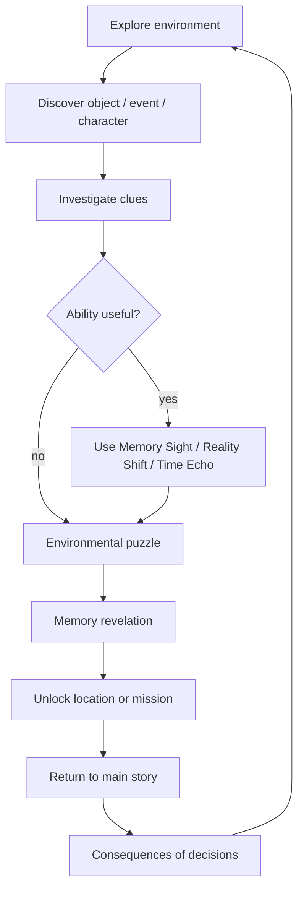
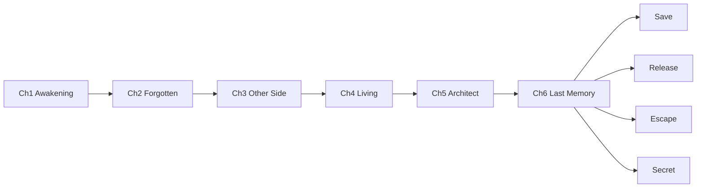

# Gameplay Flowchart

```mermaid
flowchart TD
  A[Explore environment] --> B[Discover object / event / character]
  B --> C[Investigate clues]
  C --> D{Ability useful?}
  D -- yes --> E[Use Memory Sight / Reality Shift / Time Echo]
  D -- no --> F[Environmental puzzle]
  E --> F
  F --> G[Memory revelation]
  G --> H[Unlock location or mission]
  H --> I[Return to main story]
  I --> J[Consequences of decisions]
  J --> A
```

## Chapter flow

```mermaid
flowchart LR
  C1[Ch1 Awakening] --> C2[Ch2 Forgotten] --> C3[Ch3 Other Side] --> C4[Ch4 Living] --> C5[Ch5 Architect] --> C6[Ch6 Last Memory]
  C6 --> E1[Save] & E2[Release] & E3[Escape] & E4[Secret]
```
